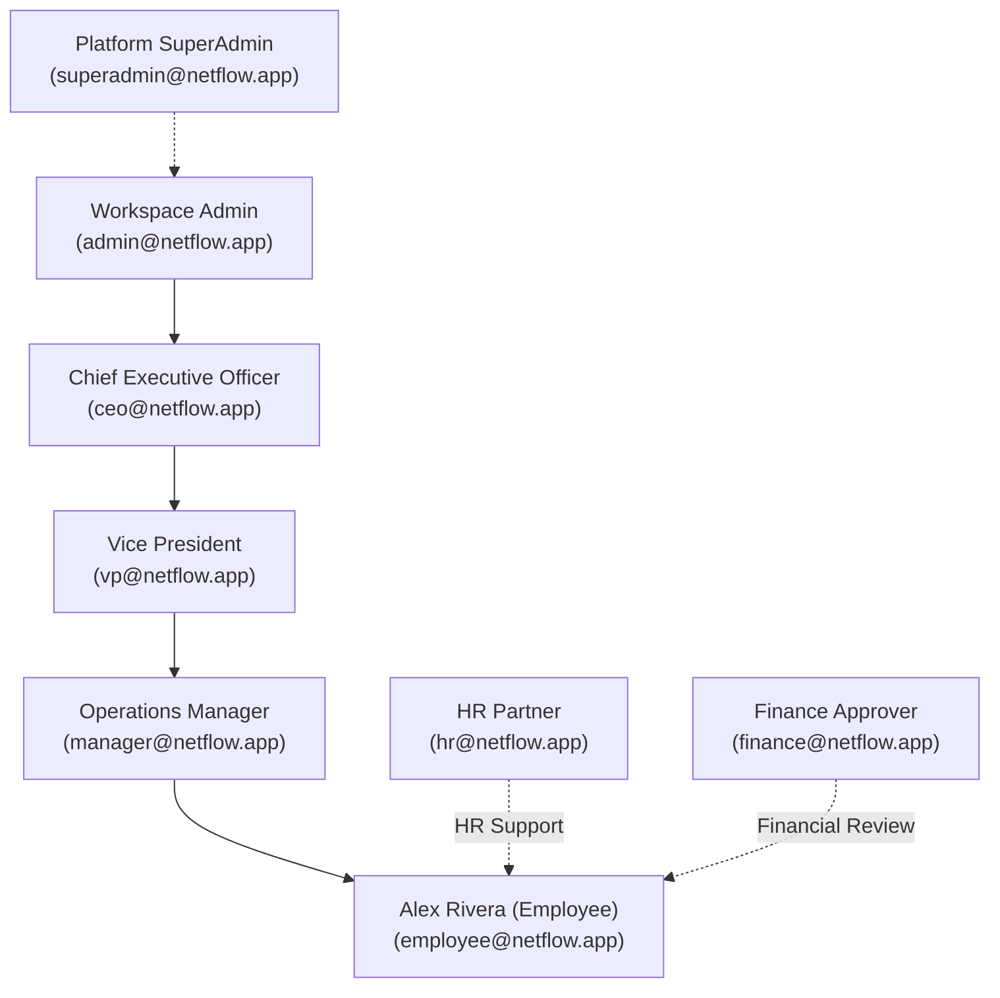

# 🔐 NetFlow System Demo Credentials

> **Default Organization:** `Default Organization` (Subdomain: `default`)  
> **API / Web URL:** `http://localhost:5173` (Frontend) | `http://localhost:5000` (Backend API)  
> **Last Generated:** 2026-09-24T13:18:36.949Z

---

## 👥 Seed User Accounts

| Role | Name | Email | Password | Department | Permissions / Description |
| :--- | :--- | :--- | :--- | :--- | :--- |
| **SuperAdmin** | Platform Super Admin | `superadmin@netflow.app` | `Super@12345` | IT | Platform management, organization creation, system-wide administration |
| **Admin** | Workspace Admin | `admin@netflow.app` | `Admin@12345` | IT | Full workspace administration, user management, and builder access |
| **CEO** | Chief Executive Officer | `ceo@netflow.app` | `Ceo@12345` | Operations | Executive decisions, organization-wide reporting, and audit oversight |
| **VP** | Vice President | `vp@netflow.app` | `Vp@12345` | Operations | Senior approvals, high-level workflow reviews, and analytics |
| **Manager** | Operations Manager | `manager@netflow.app` | `Manager@12345` | IT | Team management, direct approvals, and team workflow decisions |
| **HR** | HR Partner | `hr@netflow.app` | `Hr@12345` | HR | People-process decisions, employee onboarding, and HR approvals |
| **Finance Approver** | Finance Approver | `finance@netflow.app` | `Finance@12345` | Finance | Financial reviews, expense claims, and budget sign-offs |
| **Employee** | Alex Rivera (Employee) | `employee@netflow.app` | `Employee@12345` | IT | General workspace user, form submissions, and task execution |

---

## 🧭 Role Hierarchy & Workflow Roles

---

## 🚀 Quick Login Guide
1. Go to the login page: `http://localhost:5173/login`
2. Use any of the email & password pairs above.
3. For testing workflow approvals:
   - Submit a request as **Employee** (`employee@netflow.app`).
   - Log in as **Manager** (`manager@netflow.app`) or **HR** / **Finance** to approve/review the request in the Task Inbox.
   - Log in as **Admin** or **CEO** to inspect forms, workflows, and workspace analytics.
